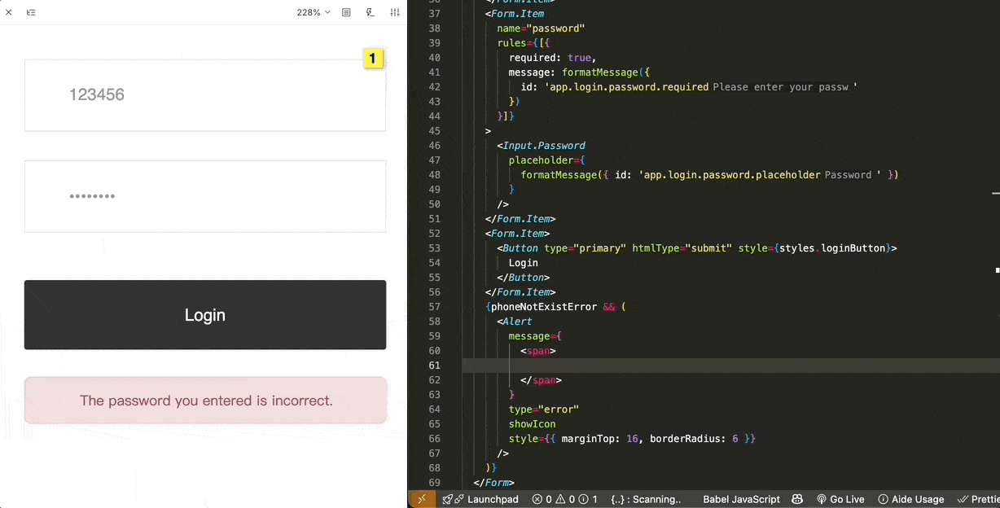
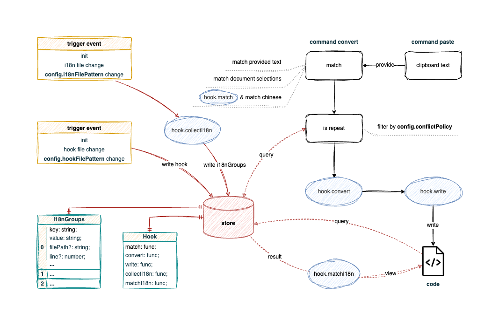

# I18n Fast

      

A hook-driven i18n plugin that supports diverse development scenarios.

**English** **|** [**简体中文**](./README.zh-cn.md)

## Preface

The biggest pain point with existing i18n plugins on the market is that they cannot cover the internationalization needs of every project.

Take our company’s project as an example: the requirement is to automatically generate a key based on the semantic meaning of a text entry and write it into the corresponding i18n file and code, making internationalization development as simple as regular development. Although the requirement sounds simple, a suitable plugin was hard to find.

[i18n Ally](https://github.com/lokalise/i18n-ally) focuses more on translation and management, and does not support automatic key generation—you have to input keys manually; [Du I18N](https://github.com/ctq123/du-i18n) generates keys as hash values, which do not meet my needs, and cannot directly write to i18n files (manual synchronization is required). Additionally, both plugins impose strict restrictions on the project tech stack and have limited support for PHP.

**I18n Fast** is an i18n generation plugin that emphasizes **customizability**. The plugin itself does not implement specific functionality; instead, it leverages a hook mechanism that allows users to implement their own logic. The plugin simply connects the hooks to make the process work. In short, by increasing configuration overhead and enabling the dynamic execution of external code, it sacrifices some out-of-the-box ease for generality and flexibility, thereby meeting the internationalization needs of a wider range of projects.

If other i18n plugins cannot meet your requirements and you're willing to invest some time understanding and writing hook files, then **I18n Fast** is your ideal choice.

## Features

- Supports i18n feedback display
- Supports jumping to i18n definitions
- Supports i18n conflict resolution (duplicate definitions)
- Supports i18n conversion via clipboard text, selected text, or custom logic
- Supports batch matching of Chinese text for i18n conversion
- Theoretically supports any functionality you want (via hooks)
- ~~Supports searching i18n~~ https://github.com/lvboda/vscode-i18n-fast/issues/1

## Quick Start

Search for **I18n Fast** in the VS Code Marketplace and click **Install**, or download the corresponding version from [releases](https://github.com/lvboda/vscode-i18n-fast/releases). In VS Code, open the Command Palette with `ctrl + shift + p`, type `Install from VSIX`, and select the downloaded file to install.

After installing the plugin, you need to complete the [plugin configuration](#plugin-configuration) and [hook files](#hook-configuration). With a well-configured setup, you should see i18n feedback when previewing your code. Try using the [i18n-fast.convert](#i18n-fastconvert) or [i18n-fast.paste](#i18n-fastpaste) command to verify your implementation!

## Flowchart

## Configuration

### Plugin Configuration

- **i18nFilePattern:** Pattern for matching i18n files
- **hookFilePattern:** Pattern for matching hook files, default is `.vscode/i18n-fast.hook.js`
- **conflictPolicy:** How to handle duplicate i18n entries, default is `smart`
  - **reuse:** Reuse an existing i18n entry
  - **ignore:** Ignore duplicates
  - **picker:** Pop up a selector for manual choice
  - **smart:** If one matching i18n entry is found, reuse it; if multiple are found, pop up a selector for manual choice
- **autoMatchChinese:** Whether to automatically match Chinese text, default is `true`

> The **i18nFilePattern** is generally configured on a per-project basis in each project’s `.vscode/settings.json`.

### Hook

A hook file is a JavaScript file that exports hook methods for the plugin to call (see the [flowchart](#flowchart) for execution timing). The hook runs in Node.js, adheres to the CommonJS standard, supports asynchronous functions (async/await), and can `require` other modules (from your project or third-party libraries), so theoretically any functionality you need can be implemented.

The hook file is located based on the [config.hookFilePattern](#plugin-configuration), defaulting to `.vscode/i18n-fast.hook.js`. You can simply download the [template file](./example/i18n-fast.hook.template.js) to the corresponding location and modify it; the template already defines the hook method types.

Feel free to [submit an issue](https://github.com/lvboda/vscode-i18n-fast/issues) to share your hook files (example: https://github.com/lvboda/vscode-i18n-fast/issues/21) so others can refer to and reuse your code.

> Hook code changes take effect immediately without needing to restart the plugin or VS Code.

#### Context

The context object shared with hooks is passed as the first argument and includes:

- [context.vscode](https://code.visualstudio.com/api/references/vscode-api)
- [context.extensionContext](https://code.visualstudio.com/api/references/vscode-api#ExtensionContext)
- [context.qs](https://www.npmjs.com/package/qs)
- [context.crypto](https://www.npmjs.com/package/crypto-js)
- [context.uuid](https://www.npmjs.com/package/uuid)
- [context._](https://www.npmjs.com/package/lodash)
- [context.babel](https://babeljs.io/docs/babel-parser)
- context.hook: The hook object exported by the current file, which can call other hooks within the same file
- context.i18n: The instance handling i18n storage for reading and writing i18n entries
- context.convert2pinyin: A method based on [tiny-pinyin](https://www.npmjs.com/package/tiny-pinyin) to convert Chinese characters to pinyin
- context.isInJsxElement: A method based on [babel](https://babeljs.io/docs/babel-parser) to determine if the code is inside a JSX element
- context.isInJsxAttribute: A method based on [babel](https://babeljs.io/docs/babel-parser) to determine if the code is inside a JSX attribute
- context.writeFileByEditor: A method to write files via the editor
- context.getICUMessageFormatAST: A method to get the ICU MessageFormat AST using [@formatjs/icu-messageformat-parser](https://www.npmjs.com/package/@formatjs/icu-messageformat-parser)
- context.safeCall: A helper function to catch and ignore errors thrown during function execution
- context.asyncSafeCall: The async version of safeCall
- context.getConfig: Retrieves the [plugin configuration](#plugin-configuration)
- context.getLoading: Get the global loading state
- context.setLoading: Set the global loading state
- context.showMessage: A simplified version of a VS Code popup message
- context.matchChinese: Chinese matching method (implementation of `autoMatchChinese: true`)

The above lists the public properties available to every hook. There are additional properties (such as `context.document`, `context.convertGroups`, `context.i18nFileUri`, etc.) that are specific to the hook execution context; refer to the [template file](./example/i18n-fast.hook.template.js) for detailed definitions.

#### hook.match

Executed at the very start of the [i18n-fast.convert](#i18n-fastconvert) command, this hook customizes how text in the current document is matched and returns the matching results. Note the priority: if the [i18n-fast.paste](#i18n-fastpaste) command is invoked or text is selected, `hook.match` will not run.

In [this example](https://github.com/lvboda/vscode-i18n-fast/issues/21), `hook.match` is used to match all text wrapped in `#(...)` in the current document.

#### hook.convert

Executed immediately after [`hook.match`](#hookmatch), this hook processes or pre-treats the data.

In [this example](https://github.com/lvboda/vscode-i18n-fast/issues/21), `hook.convert` defines the code replacement text as `formatMessage({ id: 'xxx' })`; if inside JSX or a JSX attribute, it wraps the result in `{...}` and generates a uuid as a loading i18n key for later lookup and replacement.

#### hook.write

Executed after [`hook.convert`](#hookconvert), this hook writes the data to a file.

In [this example](https://github.com/lvboda/vscode-i18n-fast/issues/21), `hook.write` first writes the code file synchronously (using the loading key), then calls an AI interface to generate a concise key based on semantics, determines in which i18n file the key should appear, and finally writes the AI-generated key to replace the loading key in the code and writes the i18n definition into the corresponding file.

#### hook.collectI18n

Triggered during initialization, configuration, or when i18n files change, this hook collects i18n data.

In [this example](https://github.com/lvboda/vscode-i18n-fast/issues/21), `hook.collectI18n` loads the i18n file content based on the `i18nFileUri` parameter and converts it into an `I18nGroup[]` format.

#### hook.matchI18n

Triggered while browsing code, this hook filters matched i18n keys or customizes i18n feedback/jump/hoverMessage functionality, with matching based on the i18nKey by default.

In [this example](https://github.com/lvboda/vscode-i18n-fast/issues/21), `hook.matchI18n` filters keys to ensure they contain a dot (`.`), and keys not wrapped in quotes only support jump and hoverMessage, to avoid inaccuracies (see https://github.com/lvboda/vscode-i18n-fast/issues/3 for details).

## Commands

### i18n-fast.convert

The convert command transforms matched text into the i18n format.

**Shortcut:** `cmd + option + c` (macOS) / `ctrl + alt + c` (Windows/Linux)

**Execution Flow:**
1. Match text (priority: parameter text > selected text > hook.match + ~~Chinese matching~~)
2. Convert data (via hook.convert)
3. Write to file (via hook.write)

### i18n-fast.paste

The paste command converts text from the clipboard into the i18n format and pastes it.

**Shortcut:** `cmd + option + v` (macOS) / `ctrl + alt + v` (Windows/Linux)

**Execution Flow:**
1. Retrieve text from the clipboard
2. Call [`i18n-fast.convert`](#i18n-fastconvert) with the clipboard text as input

### i18n-fast.undo

The undo command undoes all file write operations performed in this session.

**Shortcut:** `cmd + option + b` (macOS) / `ctrl + alt + b` (Windows/Linux)

## FAQ

### I still don't know how to configure it after reading the documentation. What should I do?

Each project in the [test folder](./test) is a complete usage example that you can refer to directly. If you're still confused, please [submit an issue](https://github.com/lvboda/vscode-i18n-fast/issues).

### I don't want to write code. Is there another way to use it directly?

Check the issues under the [hook example label](https://github.com/lvboda/vscode-i18n-fast/labels/hook%20example) for some hook examples you can refer to or use directly.

### Is executing dynamic code a security risk?

I18n Fast is a fully standalone application. In theory, as long as you ensure that the hook code you write is secure, there is no security risk.

## License

[MIT](./LICENSE)

Copyright (c)
2025 - Boda Lü
