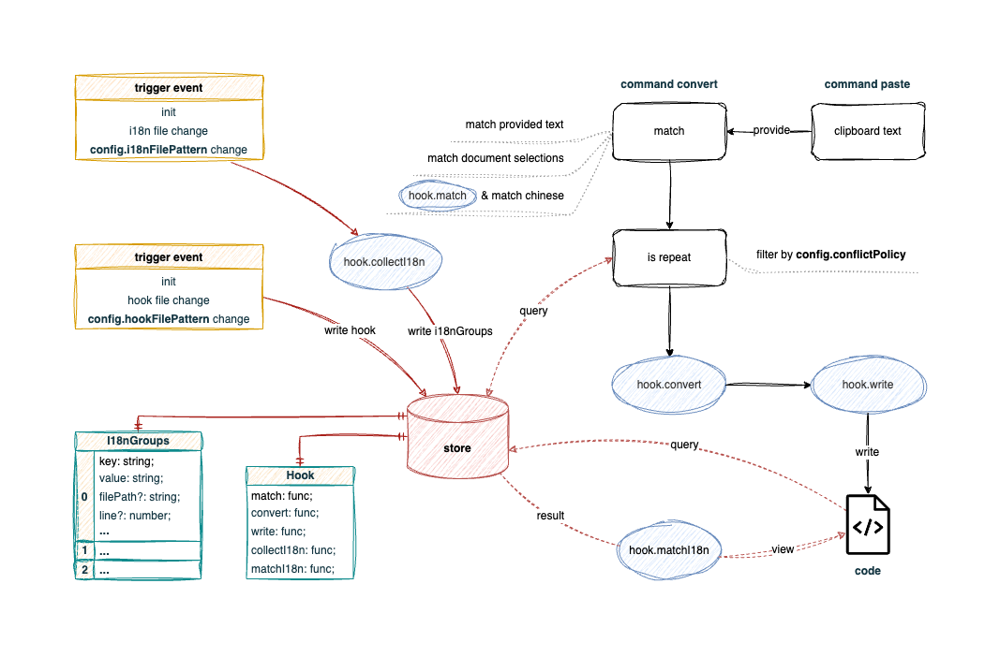

# I18n Fast

      

一个支持动态配置的 i18n 流程化处理插件

[**English**](./README.md) **|** **简体中文**

## 写在前面
在 i18n 项目的开发中，文案编写、翻译、管理以及代码可读性都是待解决的关键痛点。多数项目中，翻译环节往往会拖慢整体开发效率；而在部分项目中，虽有专门的翻译系统接手这一工作，但手动编写 i18n 代码和命名 i18n key 的流程依然耗时费力，成为效率提升的瓶颈。

当前市面上的 i18n 插件往往侧重于某个单一功能：例如，i18n Ally 主要聚焦于翻译和管理，而 Du I18N 则专注于自动生成功能；此外，它们通常难以适配各种技术栈。实际开发中，我们迫切需要一款能够根据项目实际情况动态配置、灵活调整处理流程的 i18n 插件。

基于这一需求，I18n Fast 应运而生。这是一款支持动态配置和流程化处理的 i18n 插件，能让你根据不同项目需求定制专属的处理逻辑。如果你希望**根据项目动态配置如何处理 i18n**，并且**愿意花时间编写配置文件**，那么 I18n Fast 将是你的理想选择。

## 功能

- 支持windows/macOS操作系统
- 支持截图粘贴上传
- 支持单/多文件粘贴上传
- 支持单/多文件删除（云端删除）
- 支持自定义上传、删除快捷键
- 理论上支持一切以 `multipart/form-data` 类型传输的接口，如 `smms/vgy.me` 图床的接口

## 安装

在 vscode 扩展市场搜索 `Img Fast` ，点击 install 进行安装，或者使用快捷键 `ctrl + p` 并在输入框输入 `ext install img-fast` 。

## 使用

1. 首先完善配置项，其中 `authorization` 、 `uploadUrl` 、 `uploadMethod` 、`uploadFormDataKey` 这几项必须设置，否则无法上传。

2. 截图或复制图片文件粘贴至文档中就可以自动调用 `uploadUrl` 设置的接口进行文件上传了。（也可以 [自定义上传快捷键](#自定义命令快捷键)）

## 配置

## 许可

[MIT](./LICENSE)

Copyright (c) 2025 - Boda Lü